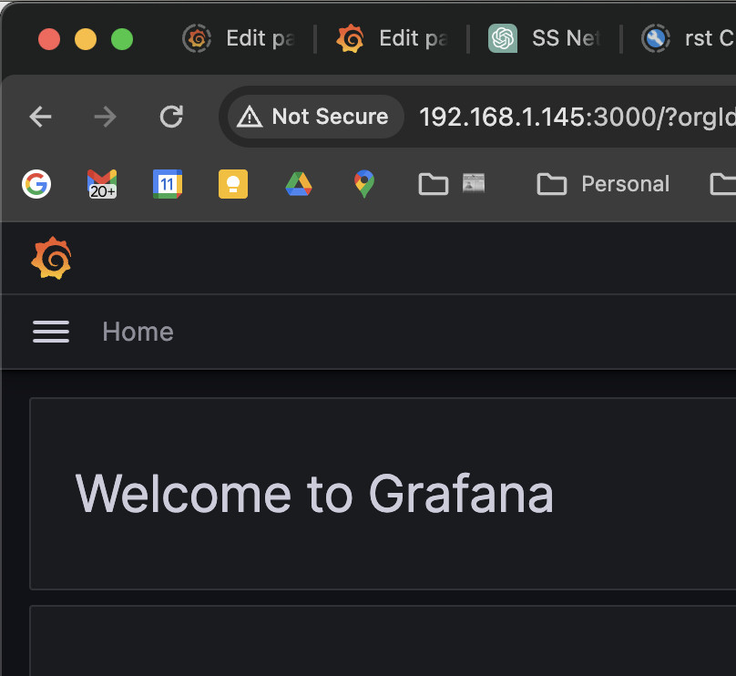
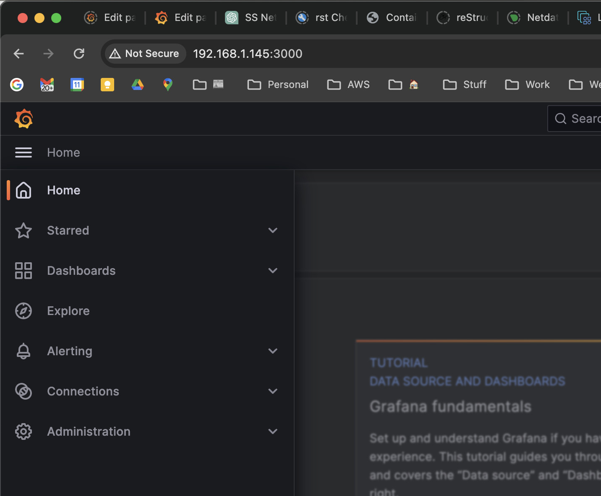
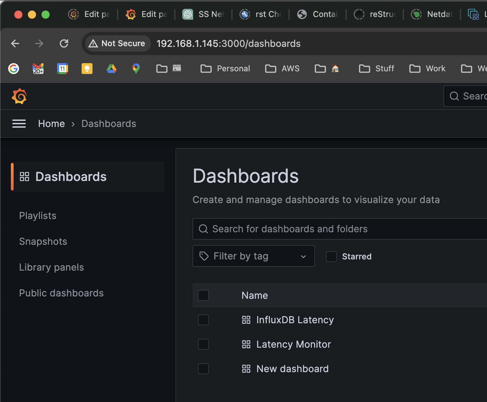
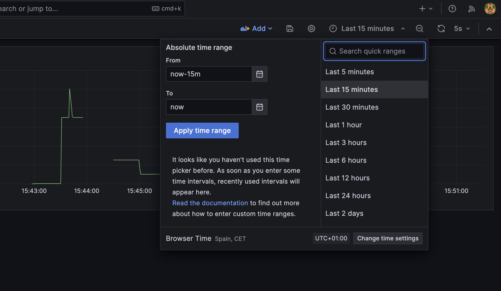

=============
Installation
=============

Install Basic apt Packages
==========================

  - ``sudo apt -y update``
  - ``sudo apt -y install git``
  - ``sudo apt -y install make``
  - ``sudo apt -y install sphinx-doc``
  - ``sudo apt -y install sphinx-common``
  - ``sudo apt -y install python3.10-venv``
  - ``sudo apt -y install bridge-utils``

NOTE: bridge-utils is deprecated; need to figure out what the new
tool is and how to invoke it.

Install docker
===============
First, update your existing list of packages:

``sudo apt update``

Next, install a few prerequisite packages which let apt use packages over HTTPS:

``sudo apt install apt-transport-https ca-certificates curl software-properties-common``

Then add the GPG key for the official Docker repository to your system:

``sudo curl -fsSL https://download.docker.com/linux/ubuntu/gpg -o /etc/apt/keyrings/docker.asc``

Add the Docker repository to APT sources

.. code-block:: bash
  
  echo \
    "deb [arch=$(dpkg --print-architecture) signed-by=/etc/apt/keyrings/docker.asc] https://download.docker.com/linux/ubuntu \
    $(. /etc/os-release && echo "$VERSION_CODENAME") stable" | \
    sudo tee /etc/apt/sources.list.d/docker.list > /dev/null

Update your existing list of packages again for the addition to be recognized:

``sudo apt update``

Make sure you are about to install from the Docker repo instead of the default Ubuntu repo:

``apt-cache policy docker-ce``

You’ll see output like this, although the version number for Docker may be different:

Output of apt-cache policy docker-ce
docker-ce:
Installed: (none)
Candidate: 5:20.10.14~3-0~ubuntu-jammy
Version table:
5:20.10.14~3-0~ubuntu-jammy 500
500 https://download.docker.com/linux/ubuntu jammy/stable amd64 Packages
5:20.10.13~3-0~ubuntu-jammy 500
500 https://download.docker.com/linux/ubuntu jammy/stable amd64 Packages
Notice that docker-ce is not installed, but the candidate for installation is from the Docker repository for Ubuntu 22.04 (jammy).
---

Finally, install Docker:

``sudo apt-get install docker-ce docker-ce-cli containerd.io docker-buildx-plugin docker-compose-plugin``

Set up everything
=================
opennetem includes a script that gets everything set up.  You can
just run the script or pick from it and execute by hand.

.. code-block:: bash

  #!/usr/bin/bash

  # Install Python virtual environment
  pip install virtualenv
  virtualenv venv
  source venv/bin/activate
  #pip3 install -r requirements.txt
  #deactivate

  # Install opennetem
  pushd .
  pip3 install --editable .
  popd

  #
  # Link from 'user' opennetem executables installed by pyproject
  # to /usr/local/bin so that they're in root's path to make it
  # easier to run the emulator as root.
  #
  echo "Linking opennetem executables to /usr/local/bin so that"
  echo "they're in root's path (using sudo)."
  EXECUTABLES="opennetem on_mon_rtt on_bplist on_bpstats"
  for item in $EXECUTABLES; do
    sudo ln -s ~/.local/bin/${item} /usr/local/bin/$item
  done

  # Make opennetem html documentation
  cd doc
  make html
  cd ..

  # Build the docker images used by opennetem
  cd netem_images
  ./build_images.sh
  cd ..

  # Restore the data volumes used by the monitoring stack
  # This includes things like the database configuration
  # and Grafana dashboard configurations
  cd monitor
  ./restore_volumes.sh
  cd ..

  # Start the monitoring stack
  # This can be left running.  If you do stop it
  # (with docker-compose down in the monitor directory)
  # you'll need to restart it if you want monitoring
  # capabilities.
  cd monitor
  docker-compose up -d
  cd ..``

Run Test1
=========

Become root in the Test/Test1 directory
  - ``cd Test/Test1``
  - ``sudo -E bash``

Start the emulation with the test1_scenario.json file
  - ``opennetem ./test1_scenario.json``

Point a browser at the host's port 3000 (Grafana)
Username/Password is admin/admin
(Change to whatever you like.  I suggest admin/admin)

From Grafana's 'hamburger' menu at the top left:

Choose ``Dashboards``

Choose InfluxDB_latency

Set the time picker in the upper right to 'Last 5 Minutes' (here it's last 15)

