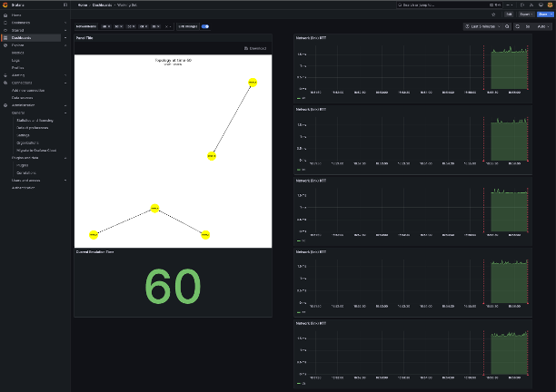
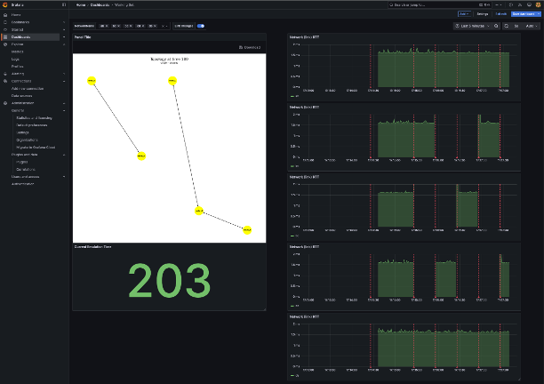
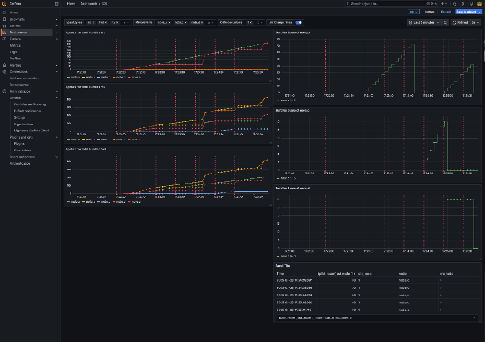

==============
Monitoring
==============

netem provides a monitoring stack that can be started with ``docker compose up -d``
from the ``NETEM_INSTALL_DIR/monitor`` directory.

The monitoring stack consists of:

monitor-prometheus-1
====================
prometheus is a time-series database that scrapes configured inputs to ingest data.
This may be useful but its resolution is limited by the scrape interval and so only
applicable to relatively slow-changing information.

monitor-statsd_exporter-1
==========================
A statsd server to which clients in containers can send data that will be scraped
by the Prometheus server.  Note that the Prometheus server scraps statsd every
15s and pulls only the latest stats, so fine-grained behaviors may be missed.

monitor-collectd-1
==================

influxDB
========
influxDB provides a fine-grained time-series database useful for detailed inspection of behaviors.
For example, the ``on_mon_rtt`` script that can be scripted to run on the emulation host logs information
to influxDB for link rtts measured with ``ping``, allowing Grafana to graph the time-variant properties of the
network down to the order of seconds.

Grafana_Visualization
=====================
Grafana is the graphing front-end to the Prometheus and influxDB databases.

The Grafana dashboards are under active development and are really an
infrastructure for whatever YOU want to show with your emulations.  That
said, thhere are some examples to get started.

Grafana runs on **port 3000** on the host.

The initial **username/password** is: **admin/admin**

'Working Set' Dashboard
-----------------------

The 'Working Set' dashboard shows basic information about the scenario,
such as the scenario (relative) time, a picture of the current topology,
and optionally information about the per-link round trip times.

The following are two screenshots from an ION test showing the above near times 60 and 203:

ION Dashboard
-------------

The 'ION' dashboard shows information specific to the Interplanetary Overlay
Network (ION) implementation of the Bundle Protocol.  At the time of this
writing it includes the ability to graph the numbers of bundles sourced, forwarded, and
received at the nodes selected in the ONNodeName picker.

It also shows the numbers of bundles queued at the nodes selected in the ONNodeName
picker, grouped by (src, dst) node numbers.  That is, it can show the number of
bundles queued at node_b with source node number 1 and destination node number 5, e.g.

