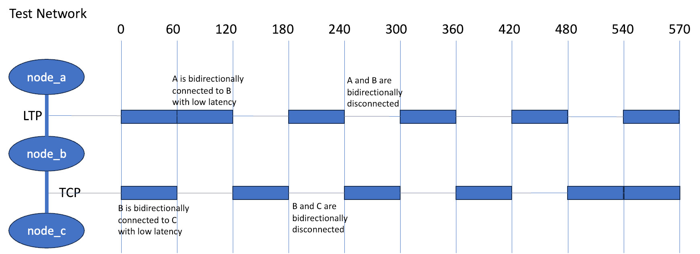

Test3
========

Network
-------------
This test uses a 3-node linear network where each node is running ION.
The first two nodes (node_a and node_b) are connected via LTP convergence
layers (CLAs); node_b and node_c are connected using TCPCLAs.

Dynamic Connectivity
--------------------------

The connectivity for the test is dynamic, with both links 'up' for the
first 60 seconds.  After that, connectivity repeats in two minute cycles
where ``node_a`` is connected to ``node_b`` during the first minute of
the cycle and disconnected during the second minute; ``node_b`` is
connected to ``node_c`` during the second minute of each cycle and is
disconnected during the first minute.  This is illustrated here:

This test starts ION on the nodes and starts a bping from node_a to node_c

bping Results
-------------
One of the commands in the test3_scenario.json script is:

``{"time":  5, "nodes": ["node_a"], "command": "nohup /netem/netem_tools/bping_monitor.sh ipn:1.3 ipn:3.1 NETEM_START_TIME >& /netem/mounts/node_a/bping_3.1.out &"}``

The ``--verbose`` flag and shell output redirection create a file with the following::

  kscott@nucbuntu:~/Projects/netsim/Test/Test3$ cat mounts/node_a/bping_3.1.out
  Fri Feb 16 14:43:56 UTC 2024 ====  8: 64 bytes from ipn:3.1  seq=0 time=2.886650 s
  Fri Feb 16 14:43:57 UTC 2024 ====  9: 64 bytes from ipn:3.1  seq=1 time=2.898079 s
  Fri Feb 16 14:43:57 UTC 2024 ====  9: 64 bytes from ipn:3.1  seq=2 time=1.895505 s
  Fri Feb 16 14:43:57 UTC 2024 ====  9: 64 bytes from ipn:3.1  seq=3 time=0.896924 s
  Fri Feb 16 14:43:58 UTC 2024 ==== 10: 64 bytes from ipn:3.1  seq=4 time=0.859886 s
  Fri Feb 16 14:43:59 UTC 2024 ==== 11: 64 bytes from ipn:3.1  seq=5 time=0.857123 s
  Fri Feb 16 14:44:00 UTC 2024 ==== 12: 64 bytes from ipn:3.1  seq=6 time=0.855182 s
  Fri Feb 16 14:44:01 UTC 2024 ==== 13: 64 bytes from ipn:3.1  seq=7 time=0.853730 s
  Fri Feb 16 14:44:02 UTC 2024 ==== 14: 64 bytes from ipn:3.1  seq=8 time=0.851382 s
  Fri Feb 16 14:44:03 UTC 2024 ==== 15: 64 bytes from ipn:3.1  seq=9 time=0.849977 s

where the number after the `====` is the relative simulation time.

The ``bping_analysis.py`` script in node_a's mount directory analyzes the output of
script and produces a summary: ::

  Min seqno:               0
  Max seqno:               263
  Total number of replies: 264
  Seqno delta:             264
  Num unique seqnos seen:  264
  Min RTT: 0.79
  Max RTT: 92.14
  Ave RTT: 48.15

showing that ION did in fact deliver all of the bpings / responses, even if the RTT was sometimes > 90s.

If we plot received bping sequence number vs receive order, we can see that ION does sometimes misorder bundles.
This tends to happen at discontinuities in the network connectivity, suggesting that it might be
LTP retransmissions / repairs that are the culprit.

