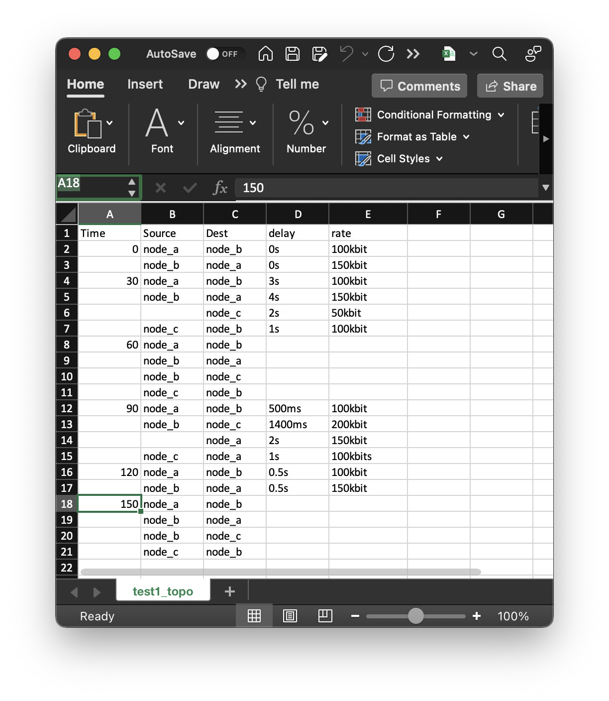

Network Topology File Format
============================
The Network Emulator supports the following file formats.  The emulator
uses the format implied by the file extension (i.e. .csv, .json, .xlsx)

CSV Format (.csv)
-----------------

CSV files need to have the following columns:
    - Time
    - Source
    - Dest
    - delay
    - rate
    - loss (optional)

If the ``time`` or ``source`` is omitted from a column, the value of the
entry from the previous row will be used.

If the csv file format, entries are passed through ``.strip().rstrip()``
to remove whitespace before or after the entry.  This has NOT been
tested with node names containing spaces, though it might work.

The values in the ``delay``, ``rate``, and optional ``loss`` columns are passed
directly as arguments to ``tc netem ...``

If the ``delay`` column is empty then the link is disconnected (it is set to
have a low delay, a high rate, and 100% packet loss).

An example csv time-variant topology file is::

    Time,   Source,     Dest,       delay,      rate
    0,      node_a,     node_b,     0s,         100kbit
    ,       node_b,     node_a,     0s,         150kbit
    30,     node_a,     node_b,     3s,         100kbit
    ,       node_b,     node_a,     4s,         150kbit
    ,       ,           node_c,     2s,         50kbit
    ,       node_c,     node_b,     1s,         100kbit
    60,     node_a,     node_b,     ,
    ,       node_b,     node_a,     ,
    ,       node_b,     node_c,     ,
    ,       node_c,     node_b,     ,
    90,     node_a,     node_b,     500ms,      100kbit
    ,       node_b,     node_c,     1400ms,     200kbit
    ,       ,           node_a,     2s,         150kbit
    ,       node_c,     node_a,     1s,         100kbits
    120,    node_a,     node_b,     0.5s,       100kbit
    ,       node_b,     node_a,     0.5s,       150kbit
    150,    node_a,     node_b,     ,
    ,       node_b,     node_a,     ,
    ,       node_b,     node_c,     ,
    ,       node_c,     node_b,     500ms,      100kbit
    ,       node_b,     node_c,     1400ms,     200kbit
    ,       ,           node_a,     2s,         150kbit
    ,       node_c,     node_a,     1s,         100kbits
    120,    node_a,     node_b,     0.5s,       100kbit
    ,       node_b,     node_a,     0.5s,       150kbit
    150,    node_a,     node_b,     ,
    ,       node_b,     node_a,     ,
    ,       node_b,     node_c,     ,
    ,       node_c,     node_b,     ,

JSON Format (.json)
-------------------

Time-variant topology can also be represented as a ``.json`` file that
containts a list of dictionaries.  Each dictionary must contain a ``time``
entry and a ``link_changes`` entry that is itself a list of dictionaries.
The ``link_changes`` entry specifies
the changes to link parameters that happen at that time.

The dictionaries that are the elements of a ``link_changes`` list should
have the following keys:

    - source (the name of the source node, e.g. ``node_a``)
    - One of:
        - dest -- the value should be the name of the destination node (e.g. ``node_a``).  If ``dest``
          is present then the dictionary should ALSO contain the destination-specific entries
          below.
        - dests -- the value should be a list of dictionaries, each of which containts
          a ``dest`` entry and the following destination-specific keys/values

The destination-specific entries are:
    - delay  (value to be passed to ``tc netem...``)
    - rate  (value to be passed to ``tc netem...``)
    - loss (value to be passed to ``tc netem...``)

An example ``json`` topoligy file is here :ref:`json_topology_example`.

Excel Format (.xlsx)
--------------------
When using excel to express a time-variant topology, you must include a
``topology_sheetname`` entry at the top level of the scenario json file in addition to
the ``topology_filename``.

The format of an excel topology file follows the format of .csv files, with column names
in the first row:

    - Time
    - Dest
    - delay
    - rate
    - loss (optional)

As with .csv files, if a ``time`` or ``source`` entry is omitted, the value from
the previous row is used.

If the ``delay`` column is empty then the link is disconnected.

